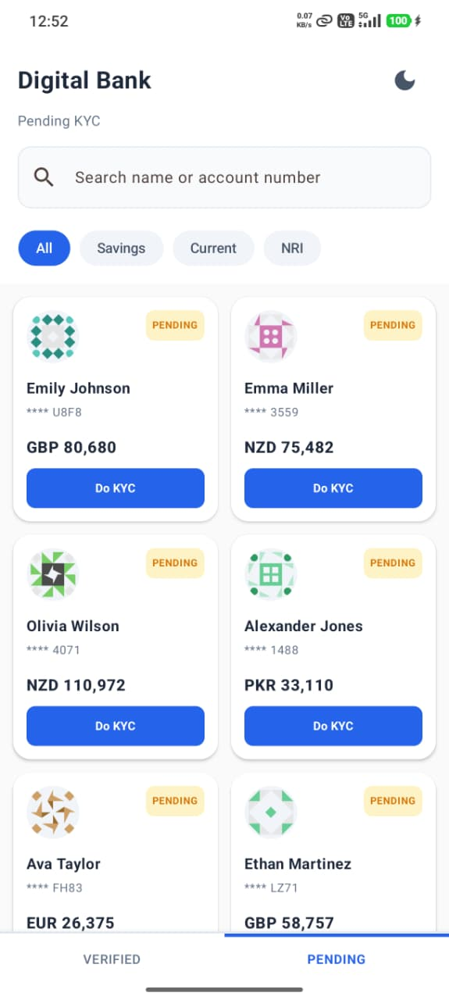
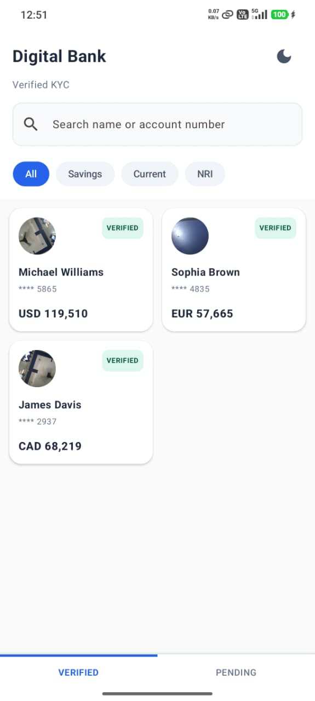
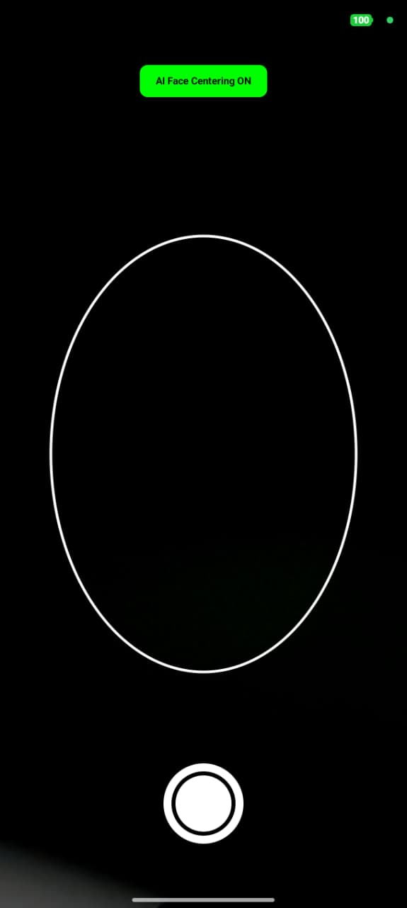
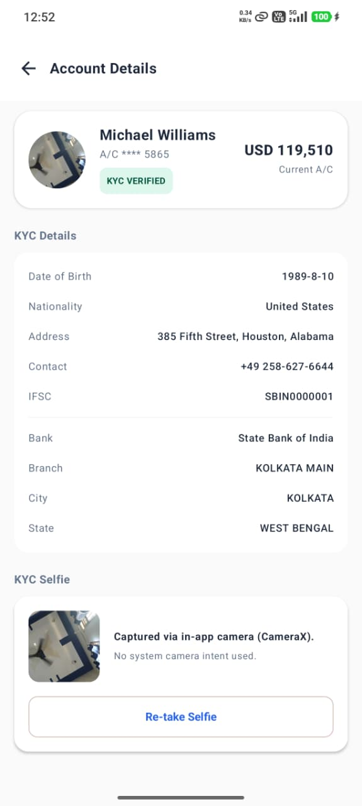
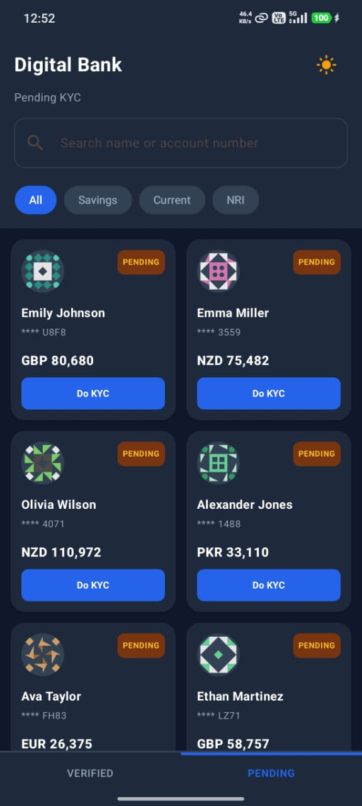
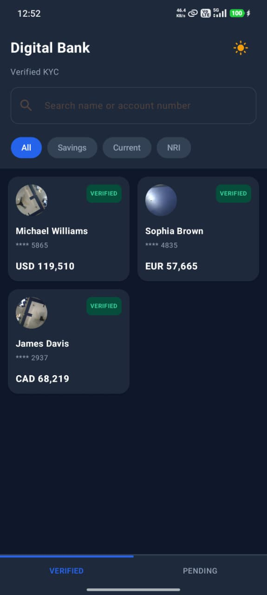
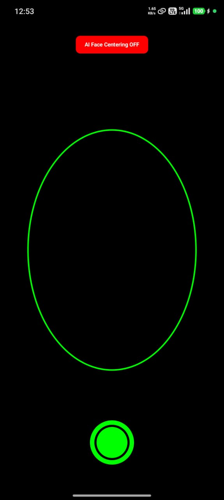
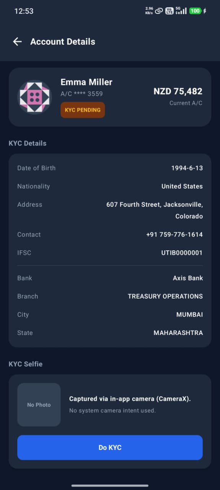

# Digital Banking KYC Assignment

An offline-first, modern Android application for a digital banking platform that allows relationship managers to browse customer accounts, view their profiles, complete KYC verification using an in-app CameraX selfie preview with real-time ML Kit Face Detection, and resolve bank branch locations live from IFSC codes.

---

## Media Attachments

## Download APK

Download and install the latest APK to try the application.

<p align="center">

<a href="https://github.com/Nerd0Vidhan/android-kyc-assignment/blob/master/resources/app/SignZy.apk">
    
</a>

</p>

Or click here:

**[SignZy.apk](https://github.com/Nerd0Vidhan/android-kyc-assignment/blob/master/resources/app/SignZy.apk)**

## Screen Recording

Click the thumbnail below to watch a complete walkthrough of the application.

[](https://youtu.be/VWv2H4zSfbU)

> **Demo includes:**
> - Customer listing with search
> - Pending & Verified KYC tabs
> - Customer details screen
> - Live IFSC bank resolution
> - CameraX in-app selfie capture
> - KYC verification flow
> - Light & Dark theme
> - App walkthrough

### App Screen Previews

## Light Theme

| Pending                                               | Verified                                               | Camera(Face Detection: ON)                            | Account Detail                                               |
|-------------------------------------------------------|--------------------------------------------------------|-------------------------------------------------------|--------------------------------------------------------------|
|  |  |  |  |

## Dark Theme

| Pending                                              | Verified                                              | Camera(Face Detection: OFF)                           | Account Detail                                              |
|------------------------------------------------------|-------------------------------------------------------|-------------------------------------------------------|-------------------------------------------------------------|
|  |  |  |  |

---

## Why ML Kit Face Detection?

The **ML Kit Face Detection** feature was added as an extra helper feature alongside the standard CameraX selfie capture. Having worked on implementing ML Kit for KYC verification processes at **Zypp Electric**, I was highly familiar with the library's performance, implementation patterns, and runtime advantages. Bringing this context into this project allowed me to create a premium, AI-guided face positioning guide with real-time feedback (oval border color transition and toast cues), while still providing an option to bypass it via a toggle chip in case of custom manual captures.

---

## Key Features

### 1. Light & Dark Theme Custom Styling
- **Sun/Moon Toggle Button**: An icon toggle button in the top-right corner of the exploration tab bar.
- **Preference Persistence**: Saves the chosen theme (Light/Dark) in the Preferences DataStore to instantly reload the layout styling on subsequent app launches.
- **Color Overrides**: Backgrounds, customer cards, border dividers, badges, detail rows, and fields dynamically map values based on the theme state.

### 2. Search Debounce & Optimized Querying
- **Coroutine flow debounce**: Added a 400ms delay (`queryFlow.debounce(400)`) inside the ViewModel.
- **Performance**: Prevents executing redundant database operations or search re-queries for every intermediate keystroke, only triggering when typing pauses.

### 3. Instant KYC State Updates
- **Room Cache Invalidation**: Saving a selfie triggers an update to the customer record's `cachedAt` timestamp.
- **Paging Source Reload**: Room automatically invalidates the paging source, telling Paging 3 to reload the list instantly. The verified customer moves out of the "Pending" tab and into the "Verified" tab immediately.

### 4. Account Details Screen (Product)
- **Detailed KYC Profile**: Renders profile metrics (avatar, name, DOB, nationality, contact, address).
- **IFSC Resolving**: Calls a live API to fetch bank details from the IFSC code.
- **Selfie Verification**: Shows the verified status, displays the captured selfie if verified, and offers "Re-take Selfie" / "Do KYC" actions.

### 5. Custom Oval Cutout & Camera Preview
- **CameraX Engine**: Native preview capturing image outputs without launching system intent pickers.
- **Custom painted Cutout**: Oval frame mask with blurred background margins.
- **Centering Border Validation**: Uses ML Kit Face Detection bounding boxes to change the oval border from **white to green** when the face is centered.
- **ML Kit Toggle**: Added an **AI Face Centering toggle** at the top center of the camera screen. If disabled, face centering is bypassed, allowing immediate capture.
- **Animated Controls**: Smooth slide-in/slide-out Compose transitions for camera buttons (Capture -> Recapture / Continue).

---

## Technology Stack & Architecture

- **Architecture**: **MVI (Model-View-Intent)** with a clean code writing.
- **UI Framework**: **Jetpack Compose** with Material 3 design.
- **Navigation**: **Compose Navigation** with slide animations and Predictive Back support.
- **Dependency Injection**: **Dagger Hilt** (`2.59.2`).
- **Annotation Processor**: **KSP** (`2.2.10-2.0.2`).
- **Database**: **Room** (`2.8.4`).
- **Preferences**: **Jetpack DataStore Preferences**.
- **Pagination**: **Paging 3** (`3.3.0`).
- **Networking**: **Retrofit 2** & **OkHttp 3** (with logging interceptors).
- **Image Loading**: **Coil Compose** (`2.6.0`).
- **Camera Framework**: **CameraX**.
- **AI Processing**: **ML Kit Face Detection** (Dynamic Delivery).

---

## File Structure

The project maintains a clean architecture subfolder structure inside the main app module:

```
app/src/main/java/in/mato/signzy/
│
├── MainApplication.kt                # Hilt application entry point
├── MainActivity.kt                   # Single Activity launching NavHost
│
├── di/                               # Dependency Injection
│   ├── AppModule.kt                  # Network and Repository binds
│   └── DatabaseModule.kt             # Room Database & DataStore binds
│
├── domain/                           # Domain Logic
│   ├── model/
│   │   └── Models.kt                 # Customer and Bank data classes
│   └── repository/
│       └── Repositories.kt           # Repository abstraction interface
│
├── data/                             # Data Layer
│   ├── local/
│   │   ├── LocalDb.kt                # Room database, DAO, entities
│   │   └── KycDataStore.kt           # Datastore settings manager
│   ├── remote/
│   │   └── Apis.kt                   # Retrofit API definitions
│   └── repository/
│       └── CustomerRepositoryImpl.kt # Repository implementation
│
└── ui/                               # View Presentation Layer
    ├── digitalBank/
    │   ├── AccountDetailScreen.kt    # Account Detail Screen
    │   ├── DigitalBankIntent.kt      # Intent handler
    │   ├── DigitalBankScreens.kt     # Accounts List(Pending , Verified tabs)
    │   └── DigitalBankViewModel.kt   # MVI ViewState
    ├── mlKit/
    │   ├── CameraPreview.kt          # CameraX, Custom Cutout overlay, Analyzer
    │   └── MlKitDownloader.kt        # ModuleInstallClient downloading engine
    └── utils/                        # Common Components package
        └── ModelDownload.kt          # Model Downloading Screen
        
```
